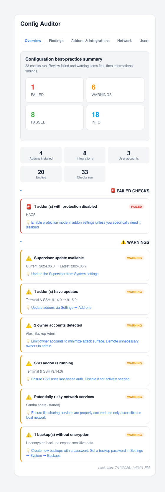
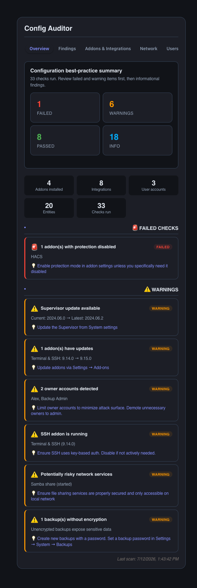

# Config Auditor


Configuration best-practices audit for Home Assistant, in a Lovelace card.
Checks token/auth hygiene, network exposure, add-on configuration and
integration health, and reports Pass / Warning / Failed / Info findings with
actionable fixes. It's a heuristic, client-side review aid — not a security
scanner, and it changes nothing on its own.

[](https://github.com/MacSiem/ha-config-auditor/releases) [](LICENSE)

## How it works

**Short version: it works automatically.** Add the card — no configuration is
required beyond an optional title:

1. **Supervisor & core status.** On load, the card reads Home Assistant Core,
   Supervisor, OS and host info via the Supervisor API (`/core/info`,
   `/supervisor/info`, `/os/info`, `/host/info`) and flags available updates.
   These checks are skipped gracefully on non-Supervised installs (a "No
   Supervisor API" info finding explains what's unavailable).
2. **Add-on hygiene.** Installed add-ons are listed (`/addons`) and checked
   for disabled protection mode, missing auto-update, host networking,
   privileged access, exposed ports without Ingress, and known "risky"
   services (SSH, Samba, FTP, Telnet).
3. **Network & exposure.** External/internal URL scheme (HTTPS vs. plain
   HTTP), certificate management (DuckDNS/Nabu Casa auto-renewed vs. manual),
   CORS, Nabu Casa Cloud status, and Supervisor network interfaces
   (`/network/info`) are all reviewed for exposure risks.
4. **Users & auth.** Registered users (`config/auth/list`) are checked for
   multiple owner accounts, local-only restriction, and long-lived access
   tokens (`auth/long_lived_access_token/list`); deprecated
   `legacy_api_password` and `trusted_networks` auth providers are flagged if
   present.
5. **Integrations, entities & backups.** Integrations (`config_entries/list`)
   are listed by source and status; entity IDs are scanned for cameras,
   person trackers, shell commands and webhook triggers; backups
   (`/backups`) are checked for missing encryption; a running Mosquitto
   add-on has its anonymous-access setting verified.
6. **Findings, not fixes.** Every check produces a Pass, Warning, Failed or
   Info finding with a description and, where relevant, a one-line
   suggested fix. The audit re-runs automatically every 5 minutes while the
   card is visible — nothing is changed in your configuration automatically.

### What is automatic vs. manual

| Automatic | Manual (optional) |
|---|---|
| Full audit on first load, then every 5 minutes | Nothing required to start |
| Supervisor/OS/Core update checks (HA OS/Supervised only) | Applying any suggested fix yourself |
| Add-on, network, user, integration and entity checks | Reloading the dashboard to force an earlier re-scan |
| Pass/Warning/Failed/Info summary and tabs | Setting a custom card title |

## Screenshots

| Light | Dark |
|---|---|
|  |  |

*Overview tab: check summary (Failed / Warnings / Passed / Info), key counts
and the Failed/Warning findings. Dark mode follows your Home Assistant theme
automatically.*

## Installation

1. Open HACS → Custom repositories.
2. Add `https://github.com/MacSiem/ha-config-auditor` as category
   **Dashboard** (Lovelace plugin).
3. Install **Config Auditor** and reload your browser.

## Quick start

```yaml
type: custom:ha-config-auditor
```

That's it — no options are required.

### Optional sidebar panel (`configuration.yaml`)

```yaml
panel_custom:
  - name: ha-config-auditor
    sidebar_title: Config Auditor
    sidebar_icon: mdi:home-assistant
    url_path: ha-config-auditor
    js_url: /local/community/ha-config-auditor/ha-config-auditor.js
    embed_iframe: false
    config: {}
```

After restart, **Config Auditor** appears in the HA sidebar.

## Features

- **Overview, Findings, Add-ons & Integrations, Network, Users and Tips**
  tabs.
- Pass / Warning / Failed / Info findings with actionable fix suggestions.
- Supervisor/OS/Core update checks, add-on hygiene, SSL/exposure checks,
  user and token review, backup-encryption and MQTT-auth checks.
- Bundled Bento Design System (light + dark mode, follows your HA theme,
  mobile-friendly).
- Self-contained — no shared HA Tools dependency.
- Last-scan timestamp is cached in browser `localStorage`; audit results
  themselves are recomputed on each scan, not stored.

## FAQ

**Do I have to configure anything?**
No. Add the card and it audits your instance by itself.

**Why are some checks missing / show "No Supervisor API detected"?**
Several checks (OS/Supervisor updates, add-on scanning, network interfaces,
backups) require Home Assistant OS or Supervised. On Core-only or Container
installs, those sections show an info finding instead of failing silently.

**Will this change my configuration?**
No. Config Auditor only reads state via the Home Assistant WebSocket/REST
API — it never calls a service that changes configuration. Every finding
includes a fix you apply yourself.

**Does this send data anywhere?**
No. All checks run locally in your browser against your own Home Assistant
instance — no telemetry, no analytics, no external network calls, and no
CDN-hosted assets (system fonts only). Nothing leaves your device.

## Changelog

See [CHANGELOG.md](CHANGELOG.md).

## Support

If this tool makes your Home Assistant life easier, consider supporting
development:

- [Buy Me a Coffee](https://buymeacoffee.com/macsiem)
- [PayPal](https://www.paypal.com/donate/?hosted_button_id=Y967H4PLRBN8W)

## License

MIT, see [LICENSE](LICENSE).
