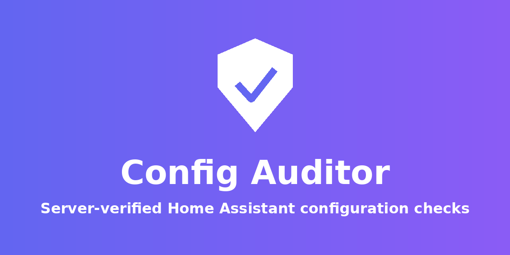
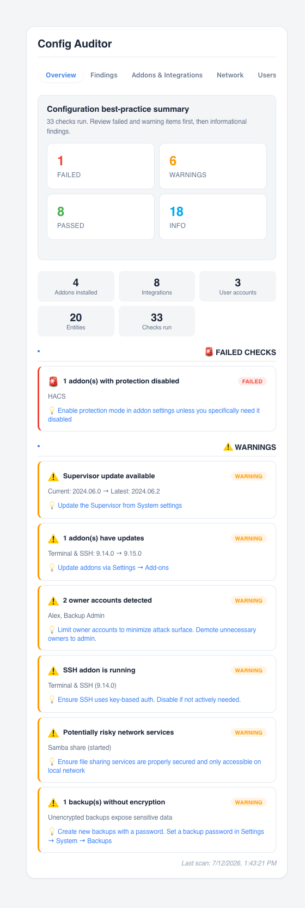
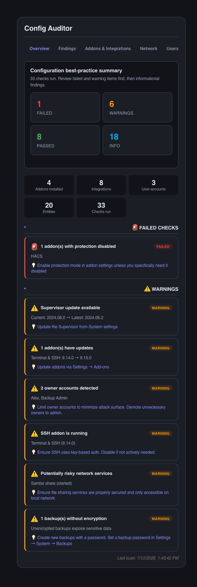

# Config Auditor



Configuration best-practices audit for Home Assistant. Since 6.0.0 the
repository contains a **Home Assistant integration** that verifies login,
administrator and HTTP settings on the server and scans YAML files for
plain-text secrets, plus the Config Auditor card and an admin-only sidebar
panel. It reports Pass / Warning / Failed / Info findings with fixes and
changes nothing on its own. It is a review aid, not a security scanner.

[](https://github.com/MacSiem/ha-config-auditor/releases) [](LICENSE)

## How it works

**Server-verified checks (integration).** The integration runs these on the
Home Assistant server, where the real settings are available, and returns
them through an admin-only WebSocket command (`ha_config_auditor/audit`):

| Check | What is read |
|---|---|
| Login providers | Enabled auth providers; `legacy_api_password` fails, `trusted_networks` warns (fails with `allow_bypass_login`) |
| Administrator MFA | Active administrators who can log in remotely and have no MFA module enabled |
| HTTPS | Whether HA serves TLS itself or the external URL uses HTTPS |
| Trusted proxies | `trusted_proxies` of the running HTTP server; `0.0.0.0/0` fails, large public ranges warn |
| IP ban | Whether failed logins lead to an IP ban (`ip_ban_enabled` + `login_attempts_threshold`) |
| Plain-text secrets | YAML files in the config folder with `password`/`token`/`api_key`/`secret` values not using `!secret` — reported as file, line and key; **values are never read into the result** |

A check that cannot run is shown as *not checked* with the reason — never as
passed. Without the integration the card says these checks are unavailable
instead of guessing.

**Browser checks (card).** The card adds what the frontend can read itself:

1. **Supervisor & core status.** On load, the card reads Home Assistant Core,
   Supervisor, OS and host info via the Supervisor API (`/core/info`,
   `/supervisor/info`, `/os/info`, `/host/info`) and flags available updates.
   These checks are skipped gracefully on non-Supervised installs (a "No
   Supervisor API" info finding explains what's unavailable).
2. **Add-on hygiene.** Installed add-ons are listed (`/addons`) and checked
   for disabled protection mode, missing auto-update, host networking,
   privileged access, exposed ports without Ingress, and known "risky"
   services (SSH, Samba, FTP, Telnet).
3. **Network & exposure.** External/internal URL scheme (HTTPS vs. plain
   HTTP), certificate management (DuckDNS/Nabu Casa auto-renewed vs. manual),
   CORS, Nabu Casa Cloud status, and Supervisor network interfaces
   (`/network/info`) are all reviewed for exposure risks.
4. **Users & auth.** Registered users (`config/auth/list`) are checked for
   multiple owner accounts, local-only restriction, and long-lived access
   tokens (`auth/long_lived_access_token/list`); deprecated
   `legacy_api_password` and `trusted_networks` auth providers are flagged if
   present.
5. **Integrations, entities & backups.** Integrations (`config_entries/get`)
   are listed by source and status; entity IDs are scanned for cameras,
   person trackers, shell commands and webhook triggers; backups
   (`/backups`) are checked for missing encryption; a running Mosquitto
   add-on has its anonymous-access setting verified.
6. **Findings, not fixes.** Every check produces a Pass, Warning, Failed or
   Info finding with a description and, where relevant, a one-line
   suggested fix. The audit re-runs automatically every 5 minutes while the
   card is visible — nothing is changed in your configuration automatically.

### What is automatic vs. manual

| Automatic | Manual (optional) |
|---|---|
| Server-side checks every time the card or panel audits | Adding the integration once (Settings → Devices & services) |
| Admin-only **Config Auditor** sidebar panel | Turning the panel off, or turning on Repairs, in the integration options |
| Card registered for dashboards (no resource to add) | Applying any suggested fix yourself |
| Supervisor/OS/Core, add-on, network, user and entity checks in the card | Setting a custom card title |
| Optional: failed and warning checks as **Settings → Repairs** issues, refreshed every 12 hours | |

## Screenshots

| Light | Dark |
|---|---|
|  |  |

*Overview tab: check summary (Failed / Warnings / Passed / Info), key counts
and the Failed/Warning findings. Dark mode follows your Home Assistant theme
automatically.*

## Installation

### Integration (recommended, 6.0.0+)

1. Install the integration files:
   - **HACS:** once the HACS default catalog lists this repository as an
     **Integration**, install **Config Auditor** from HACS → Integrations.
     Until then HACS installs it as a Dashboard plugin (card only), and HACS
     does not allow adding it again as a custom Integration repository.
   - **Manual:** copy `custom_components/ha_config_auditor` from the
     [latest release](https://github.com/MacSiem/ha-config-auditor/releases)
     into your `config/custom_components/` folder.
2. Restart Home Assistant.
3. **Settings → Devices & services → Add integration → Config Auditor.**
   No questions are asked.
4. Open **Config Auditor** in the sidebar (administrators only), or add the
   card to a dashboard:

```yaml
type: custom:ha-config-auditor
```

The integration registers the card for dashboards itself. If the card is
already loaded from a HACS Dashboard install, it does not add a second copy.

**Options** (Settings → Devices & services → Config Auditor → Configure):
show or hide the sidebar panel, and report failed/warning checks in
Settings → Repairs.

### Dashboard plugin only

Installing only the card (HACS → Dashboard) still works, but server-side
checks are then reported as unavailable.

## Features

- **Overview, Findings, Add-ons & Integrations, Network, Users and Tips**
  tabs.
- Pass / Warning / Failed / Info findings with actionable fix suggestions.
- Supervisor/OS/Core update checks, add-on hygiene, SSL/exposure checks,
  user and token review, backup-encryption and MQTT-auth checks.
- Bundled Bento Design System (light + dark mode, follows your HA theme,
  mobile-friendly).
- Self-contained — no shared HA Tools dependency.
- Last-scan timestamp is cached in browser `localStorage`; audit results
  themselves are recomputed on each scan, not stored.
- Integration: server-verified checks, admin-only sidebar panel, optional
  Repairs issues, automatic card registration.

## FAQ

**Do I have to configure anything?**
No. Add the integration (no questions) and open the sidebar panel, or add the
card. Server-side checks and the panel require an administrator.

**Why are some checks missing / show "No Supervisor API detected"?**
Several checks (OS/Supervisor updates, add-on scanning, network interfaces,
backups) require Home Assistant OS or Supervised. On Core-only or Container
installs, those sections show an info finding instead of failing silently.

**Will this change my configuration?**
No. Config Auditor only reads state via the Home Assistant WebSocket/REST
API — it never calls a service that changes configuration. Every finding
includes a fix you apply yourself.

**Does this send data anywhere?**
No. Server checks run inside your Home Assistant and browser checks run in
your browser against your own instance — no telemetry, no analytics, no
external network calls and no CDN-hosted assets. The YAML scan reports file,
line and key names only, never secret values.

## Changelog

See [CHANGELOG.md](CHANGELOG.md).

## Support

If this tool makes your Home Assistant life easier, consider supporting
development:

- [Buy Me a Coffee](https://buymeacoffee.com/macsiem)
- [PayPal](https://www.paypal.com/donate/?hosted_button_id=Y967H4PLRBN8W)

## License

MIT, see [LICENSE](LICENSE).
